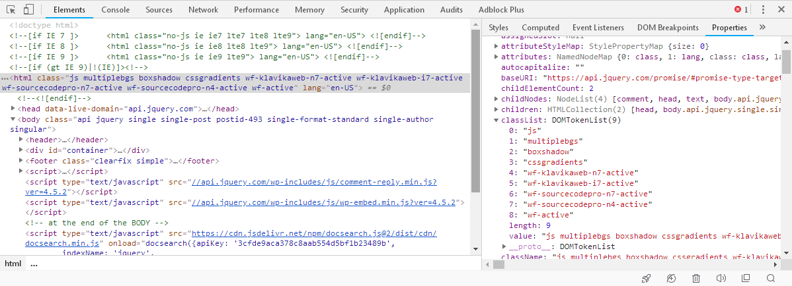

# Manipulating the DOM #

## attributes 与 properties 的区别 ##

there is a subtle distinction between HTML
attributes and DOM properties.

**Attributes** are the values given in quotation marks in the HTML source for the page, while **properties** are the values as accessed by JavaScript. We can observe attributes and properties easily in a developer tool like Chrome's:

## Creating new elements ##

Simply by passing a snippet of HTML code to the `$()` function, we can create an entirely new DOM structure from thin air.

	$('<a href="#top">back to top</a>').insertAfter('div.chapter p');

## DOM manipulation methods in a nutshell ##

- To create new elements from HTML, use the $() function
- To insert new elements inside every matched element, use the following functions:
	- .append()
	- .appendTo()
	- .prepend()
	- .prependTo()
- To insert new elements adjacent to every matched element, use the following functions:
	- .after()
	- .insertAfter()
	- .before()
	- .insertBefore()
- To insert new elements around every matched element, use the following functions:
	- .wrap()
	- .wrapAll()
	- .wrapInner()
- To replace every matched element with new elements or text, use the following functions:
	- .html()
	- .text()
	- .replaceAll()
	- .replaceWith()
- To remove elements inside every matched element, use the following function:
	- .empty()
- To remove every matched element and descendants from the document without actually deleting them, use the following functions:
	- .remove()
	- .detach()
