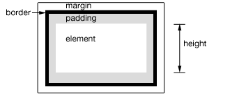

# Quick Reference #

[https://api.jquery.com](https://api.jquery.com)

[1.Selector expressions](#selector-expressions)

[1.1.Simple CSS](#simple-css)

[1.2.Position among siblings](#position-among-siblings)

[1.3.Position among matched elements](#position-among-matched-elements)

[1.4.Attributes](#attributes)

[1.5.Forms](#forms)

[1.6.Miscellaneous selectors](#miscellaneous-selectors)

[2.DOM traversal methods](#dom-traversal-methods)

[2.1.Filtering](#filtering)

[2.2.Descendants](#descendants)

[2.3.Siblings](#siblings)

[2.4.Ancestors](#ancestors)

[2.5.Collection manipulation](#collection-manipulation)

[2.6.Working with selected elements](#working-with-selected-elements)

[3.Event methods](#event-methods)

## Selector expressions ##

与CSS的选择器的语法基本相同

### Simple CSS ###

Selector|Matches|Notes
---|---|---
*|All elements.|$("body \*") [example](000.html)
\#id|The element with the given ID.|$("#choose") [example](001.html)
.class|All elements with the given class.|$(".intro") [example](002.html)
.class.class|All elements with the given classes|$(".intro.demo")
element|All elements of the given type.|$("p") [example](003.html)
a, b|Elements that are matched by a or b.|$("h1, li") [example](004.html) 
a b|Elements b that are descendants后代 of a.|$("div li") [example](005.html)
a > b|Elements b that are children of a.|$("body > p") [example](006.html)
a + b|Elements b that immediately follow a.|$("div+p") [example](007.html)
a ~ b|Elements b that are siblings of a and follow a.|$("div+ p")  [example](008.html)

### Position among siblings ###

Selector|Matches|Notes
---|---|---
:nth-child(index)|Elements that are the index child of their parent element (1-based).|$("p:nth-child(2)") [example](009.html)
:nth-child(even)|Elements that are an even child of their parent element (1-based).|$("p:nth-child(even)") [example](010.html)
:nth-child(odd)|Elements which are an odd child of their parent element (1-based).|$("p:nth-child(odd)") [example](011.html)
:nth-child(formula)|Elements that are the nth child of their parent element (1-based). Formulas are of the form an+b for integers a and b.|$("p:nth-child(3n+0)") [example](012.html)
:nth-last-child(index)|The same as :nth-child(), but counting **from the last element to the first**.|[example](013.html)
:first-child|Elements that are the first child of their parent.|$("p:first-child") [example](014.html)
:last-child|Elements that are the last child of their parent.|$("p:last-child") [example](015.html)
:only-child|Elements that are the only child of their parent.|$("p:only-child") [example](016.html)
:nth-of-type()|The same as :nth-child(), but only counting elements of the same element name.|$("p:nth-of-type(2)") [example](017.html)
:nth-last-of-type()|The same as :nth-last-child(), but only counting elements of the same element name.|$("p:nth-last-of-type(2)") [example](018.html)
:first-of-type|Elements which are the first child of the same element name among their siblings.|$("p:first-of-type") [example](019.html)
:last-of-type|Elements that are the last child of the same element name among their siblings.|$("p:last-of-type") [example](020.html)
:only-of-type|Elements that are the only child of the same element name among their siblings.|$("p:only-of-type") [example](021.html)

### Position among matched elements ###

Selector|Matches|Notes
---|---|---
:first|The first element in the result set.|$("p:first") [example](022.html)
:last|The last element in the result set.|$("p:last") [example](023.html)
:not(a)|All elements in the result set that are not matched by a.|$("p:not(.intro)") [example](024.html)
:even|Even elements in the result set (0-based).|$("tr:even") [example](025.html)
:odd|Odd elements in the result set (0-based).|$("tr:odd")  [example](026.html)
:eq(index)|A numbered element in the result set (0-based).|$("p:eq(1)") [example](027.html)
:gt(index)|All elements in the result set after (greater than) the given index (0-based).|$("tr:gt(2)") [example](028.html)
:lt(index)|All elements in the result set before (less than) the given index (0-based).|$("tr:lt(2)") [example](029.html)

### Attributes ###

Selector|Matches|Notes
---|---|---
[attr]|Elements that have the attribute attr.|$("[id]"), $("div[id]"), $("a[href^='http'][href*='henry']") [example](030.html)
[attr="value"]|Elements whose attr attribute is value.|-
[attr!="value"]|Elements whose attr attribute is not value.|-
[attr^="value"]|Elements whose attr attribute begins with value.|与Regex的^相同
[attr$="value"]|Elements whose attr attribute ends with value.|与Regex的$相同
[attr*="value"]|Elements whose attr attribute contains the substring value.|$("div[class*='test']") [example](031.html)
[attr~="value"]|Elements whose attr attribute is a space-delimited set of strings, one of which is value.|例如title="tulip flower" $("[title~=flower]")
[attr &#124;="value"]|Elements whose attr attributes is either equal to value or begins with value followed by a hyphen.|$("[lang&#124;=en]") [example](032.html)

### Forms ###

Selector|Matches|Notes
---|---|---
:input|All `<input>`, `<select>`, `<textarea>`, and `<button>` elements.|$(":input") [example](033.html)
:text|The `<input>` elements with type="text".|$(":text") [example](034.html)
:password|The `<input>` elements with type="password".|-
:file|The `<input>` elements with type="file".|-
:radio|The `<input>` elements with type="radio".|-
:checkbox|The `<input>` elements with type="checkbox".|-
:submit|The `<input>` elements with type="submit".|-
:image|The `<input>` elements with type="image".|-
:reset|The `<input>` elements with type="reset".|-
:button|The `<input>` elements with type="button" and `<input>` elements.|-
:enabled|Enabled form elements.|-
:disabled|Disabled form elements.|-
:checked|Checked checkboxes and radio buttons.|-
:selected|Selected `<input>` elements.|-

### Miscellaneous selectors ###

Selector|Matches|Notes
---|---|---
:root|The root element of the document.|[example](035.html)
:header|Header elements (for example, `<h1>`, `<h2>`).|[example](036.html)
:animated|Elements with an animation in progress.|[example](037.html)
:contains(text)|Elements containing the given text.|[example](038.html)
:empty|Elements with no child nodes.|-
:has(a)|Elements containing a descendant element matching a.|[example](039.html)
:parent|Select all elements that have at least one child node (either an element or text).|[example](040.html)
:hidden|Elements that are hidden, either through CSS or because they are `<input type="hidden" />`.|[example](041.html)
:visible|The inverse of :hidden.|[example](042.html)
:focus|The element that has the keyboard focus.|-
:lang(language)|Elements with the given language code (either due to a lang attribute on the element or an ancestor, or a `<meta>` declaration).|[example](043.html)
:target|Whichever element is targeted by the URI's fragment identifier, if any.|For example, given a document with a URI of https://example.com/#foo, $( "p:target" ) will select the `
` element.

## DOM traversal methods ##

traversal遍历

### Filtering ###

选择器进一步的选择

Traversal method|Returns a jQuery object containing…|Notes
---|---|---
.filter(selector)|Selected elements that match the given selector.|[example](044.html)
.filter(callback)|Selected elements for which the callback function returns true.|[example](045.html)
.eq(index)|The selected element at the given 0-based index.|[example](046.html)
.first()|The first selected element.|[example](048.html)
.last()|The final selected element.|[example](048.html)
.slice(start, [end])|Selected elements in the given range of 0-based indices.|[example](048.html)
.not(selector)|Selected elements that do not match the given selector.|[example](049.html)
.has(selector)|Selected elements that have a descendant matching selector.|[example](047.html)

### Descendants ###

后代

Traversal method|Returns a jQuery object containing…|Notes
---|---|---
.find(selector)|Descendant elements that match the selector.|[example](050.html)
.contents()|Child nodes (including text nodes).|[example](051.html)
.children([selector])|Child nodes, optionally filtered by a selector.|[example](052.html)

### Siblings ###

兄弟姐妹 同胞

Traversal method|Returns a jQuery object containing…|Notes
---|---|---
.next([selector])|The sibling immediately following each selected element, optionally filtered by a selector.|[example](053.html)
.nextAll([selector])|All siblings following each selected element, optionally filtered by a selector.|[example](054.html)
.nextUntil([selector],[filter])|All siblings following each selected element up to and not including the first element matching selector, optionally filtered by an additional selector.|[example](055.html)
.prev([selector])|The sibling immediately preceding each selected element, optionally filtered by a selector.|[example](056.html)
.prevAll([selector])|All siblings preceding each selected element, optionally filtered by a selector.|[example](057.html)
.prevUntil([selector], [filter])|All siblings preceding each selected element up to and not including the first element matching selector, optionally filtered by an additional selector.|[example](058.html)
.siblings([selector])|All siblings, optionally filtered by a selector.|[example](059.html)

### Ancestors ###

Traversal method|Returns a jQuery object containing…|Notes
---|---|---
.parent([selector])|The parent of each selected element, optionally filtered by a selector.|[example](060.html)
.parents([selector])|All ancestors, optionally filtered by a selector.|[example](061.html)
.parentsUntil([selector], [filter])|All ancestors of each selected element up to and not including the first element matching selector, optionally filtered by an additional selector.|[example](062.html)
.closest(selector)|The first element that matches the selector, starting at the selected element and moving up through its ancestors in the DOM tree.|[example](063.html)
.offsetParent()|The positioned parent, either relative or absolute of the first selected element.|[example](064.html)

### Collection manipulation ###

这部分内容有点难理解。

Traversal method|Returns a jQuery object containing…|Notes
---|---|---
.add()|The selected elements, plus any additional elements that match the given selector.|[example](065.html) [more](https://api.jquery.com/add/#add-selector)
.addBack([selector])|The selected elements, plus the previous set of selected elements on the internal jQuery stack.|[example](068.html)
.end()|The previous set of selected elements on the internal jQuery stack.结束当前链中最近的一次筛选操作，并将匹配元素集合返回到前一次的状态。|[example](066.html)
.map(callback)|The result of the callback function when called on each selected element.|[example](067.html)
.pushStack(elements)| Add a collection of DOM elements onto the jQuery stack.|jQuery([]) .pushStack( document. getElementsByTagName("div")) .remove().end();

### Working with selected elements ###

Traversal method|Description|Notes
---|---|---
.is(selector)|Determines whether any matched element is matched by the given selector expression.|[example](069.html) [more](https://api.jquery.com/is/#is-selector)
.index()|Gets the index of the matched element in relation to its siblings.|[more](https://api.jquery.com/index/)
.index(element)|Gets the index of the given DOM node within the set of matched elements.|[example](070.html)
$.contains(a, b)|Determines whether DOM node b contains DOM node a.|$.contains( document.documentElement, document.body ); // true  $.contains( document.body, document.documentElement ); // false
.each(callback)|Iterates over the matched elements, executing callback for each element.|[example](071.html)
.length|Gets the number of matched elements.|[example](072.html)
.get()|Gets an array of DOM nodes corresponding to the matched elements.|[example](073.html)
.get(index)|Gets the DOM node corresponding to the matched element at the given index.|[example](074.html)
.toArray()|Gets an array of DOM nodes corresponding to the matched elements.|[example](075.html)

## Event methods ##

### Binding ###

Event method|Description|Notes
---|---|---
.ready(handler)|Binds handler to be called when the DOM and CSS are fully loaded.|-
.on(type, [selector], [data], handler)|Binds handler to be called when the given type of event is sent to the element. If selector is provided, performs event delegation.|[example](076.html)
.on(events, [selector], [data])|Binds multiple handlers for events as specified in the events object parameter.|[example1](077.html), [example2](078.html)
.off(type, [selector], [handler])|Removes bindings on the element.|[example](087.html)  // ... Foo will no longer be called. `$( "body" ).off( "click", "p", foo );`
.bind(type, [data], handler)|Binds handler to be called when the given type of event is sent to the element. **In general, use .on() instead.**|[example1](080.html), [example2](081.html)
.one(type, [data], handler)|Binds handler to be called when the given type of event is sent to the element. Removes the binding when the handler is called.|[example1](088.html), [example2](089.html)
.unbind([type], [handler])|Removes the bindings on the element (for an event type, a particular handler, or all bindings).|-
.delegate(selector, type, [data], handler)|Binds handler to be called when the given type of event is sent to a descendant element matching selector.|-
.delegate(selector, handlers)|Binds a collection of handlers to be called when the given types of events are sent to a descendant element matching selector.|-
.undelegate(selector, type, [handler])|Removes the bindings on the element previously bound with .delegate().|-

### Shorthand binding ###

就手写法

Event method|Description|Notes
---|---|---
.blur(handler)|Binds handler to be called when the element loses keyboard focus.|-
.change(handler)|Binds handler to be called when the element's value changes.|-
.click(handler)|Binds handler to be called when the element is clicked.|[example](079.html)
.dblclick(handler)|Binds handler to be called when the element is double-clicked.|-
.error(handler)|Binds handler to be called when the element receives an error event (browser-dependent).|-
.focus(handler)|Binds handler to be called when the element gains keyboard focus.|-
.focusin(handler)|Binds handler to be called when the element, or a descendant, gains keyboard focus.|-
.focusout(handler)|Binds handler to be called when the element, or a descendant, loses keyboard focus.|-
.keydown(handler)|Binds handler to be called when a key is pressed and the element has keyboard focus.|-
.keypress(handler)|Binds handler to be called when a keystroke occurs and the element has keyboard focus.|-
.keyup(handler)|Binds handler to be called when a key is released and the element has keyboard focus.|-
.load(handler)|Binds handler to be called when the element finishes loading.|-
.mousedown(handler)|Binds handler to be called when the mouse button is pressed within the element.|-
.mouseenter(handler)|Binds handler to be called when the mouse pointer enters the element. Not affected by event bubbling.|-
.mouseleave(handler)|Binds handler to be called when the mouse pointer leaves the element. Not affected by event bubbling.|-
.mousemove(handler)|Binds handler to be called when the mouse pointer moves within the element.|-
.mouseout(handler)|Binds handler to be called when the mouse pointer leaves the element.|-
.mouseover(handler)|Binds handler to be called when the mouse pointer enters the element.|-
.mouseup(handler)|Binds handler to be called when the mouse button is released within the element.|-
.resize(handler)|Binds handler to be called when the element is resized.|-
.scroll(handler)|Binds handler to be called when the element's scroll position changes.|-
.select(handler)|Binds handler to be called when text in the element is selected.|-
.submit(handler)|Binds handler to be called when the form element is submitted.|-
.unload(handler)|Binds handler to be called when the element is unloaded from memory.|-
.hover(enter, leave)|Binds enter to be called when the mouse enters the element, and leave to be called when the mouse leaves it.|[example1](082.html), [example2](083.html)

### Triggering ###

Event method|Description|Notes
---|---|---
.trigger(type, [data])|Triggers handlers for the event on the element and executes the default action for the event.|[example](090.html)
.triggerHandler(type, [data])|Triggers handlers for the event on the element without executing any default actions.|-

### Shorthand triggering ###

Event method|Description|Notes
---|---|---
.blur()|Triggers the blur event.|-
.change()|Triggers the change event.|-
.click()|Triggers the click event.|-
.dblclick()|Triggers the dblclick event.|-
.error()|Triggers the error event.|-
.focus()|Triggers the focus event.|-
.keydown()|Triggers the keydown event.|-
.keypress()|Triggers the keypress event.|-
.keyup()|Triggers the keyup event.|-
.select()|Triggers the select event.|-
.submit()|Triggers the submit event.|-

### Utility ###

Event method|Description|Notes
---|---|---
$.proxy(fn, context)|Creates a new function that executes with the given context.|-

### Event Object ###

Event Object|Description|Notes
---|---|---
event.target|The DOM element that initiated the event.|[example1](084.html), [example2](085.html)
event.stopPropagation()|Prevents the event from bubbling up the DOM tree, preventing any parent handlers from being notified of the event.|`$( "p" ).click(function( event ) {` `  event.stopPropagation();` `// Do something});`
event.preventDefault()| If this method is called, the default action of the event will not be triggered.|[example](086.html)

## Effect methods ##

### Predefined effects ###

Effect method|Description|Notes
---|---|---
.show()|Displays the matched elements.|[example](091.html)
.hide()|Hides the matched elements.|-
.show(speed, [callback])|Displays the matched elements by animating height, width, and opacity.|[example1](092.html), [example2](093.html)
.hide(speed, [callback])|Hides the matched elements by animating height, width, and opacity.|-
.toggle([speed], [callback])|Displays or hides the matched elements.|[example1](094.html), [example2](095.html), [example3](096.html)
.slideDown([speed],[callback])|Displays the matched elements with a sliding motion.|[example](097.html)
.slideUp([speed], [callback])|Hides the matched elements with a sliding motion.|-
.slideToggle([speed], [callback])|Displays or hides the matched elements with a sliding motion.|[example1](098.html), [example2](099.html)
.fadeIn([speed], [callback])|Displays the matched elements by fading them to opaque.|-
.fadeOut([speed], [callback])|Hides the matched elements by fading them to transparent.|-
.fadeToggle([speed], [callback])|Displays or hides the matched elements with a fading animation.|[example](100.html)
.fadeTo(speed, opacity, [callback])|Adjusts the opacity of the matched elements.|[example1](101.html), [example2](102.html), [example3](103.html)

### Custom animations ###

Effect method|Description|Notes
---|---|---
.animate(properties, [speed], [easing], [callback])|Performs a custom animation of the specified CSS properties.|[example1](104.html),[example2](105.html), [example3 效果串行与并行](106.html)
.animate(properties, options)|A lower-level interface to .animate(), allowing control over the animation queue.|[example](107.html)

### Queue manipulation ###

Effect method|Description|Notes
---|---|---
.queue([queueName])|Retrieves the queue of functions on the first matched element.|[example](108.html)
.queue([queueName], callback)|Adds callback to the end of the queue.|[example](109.html)
.queue([queueName], newQueue)|Replaces the queue with a new one.|[example](110.html)
.dequeue([queueName])|Executes the next function on the queue.|[example](109.html)
.clearQueue([queueName])|Empties the queue of all pending functions.|[example](110.html)
.stop([clearQueue],[jumpToEnd])|Stops the currently running animation, then starts queued animations, if any.|[example1](110.html), [example2](111.html), [example3](112.html)
.finish([queueName])|Stops the currently running animation and immediately advances all queued animations to their target values.|[example](111.html)
.delay(duration, [queueName])|Waits duration milliseconds before executing the next item in the queue.|[example](113.html)
.promise([queueName],[target])|Returns a promise object to be resolved once all queued actions on the collection have finished.|[example](114.html)

## DOM manipulation methods ##

### Attributes and properties ###

Manipulation method|Description|Notes
---|---|---
.attr(key)|Gets the attribute named key.|[example1](115.html), [example2](116.html)
.attr(key, value)|Sets the attribute named key to value.|-
.attr(key, fn)|Sets the attribute named key to the result of fn (called separately on each matched element).|[example1](118.html), [example2](119.html)
.attr(obj)|Sets attribute values given as key-value pairs.|[example](117.html)
.removeAttr(key)|Removes the attribute named key.|-
.prop(key)|Gets the property named key.|[example](115.html)
.prop(key, value)|Sets the property named key to value.|-
.prop(key, fn)|Sets the property named key to the result of fn (called separately on each matched element).|-
.prop(obj)|Sets property values given as key-value pairs.|-
.removeProp(key)|Removes the property named key.|-
.addClass(class)|Adds the given class to each matched element.|-
.removeClass(class)|Removes the given class from each matched element.|-
.toggleClass(class)|Removes the given class if present, and adds it if not, for each matched element.|-
.hasClass(class)|Returns true if any of the matched elements has the given class.|-
.val()|Gets the value attribute of the first matched element.|[example1](120.html), [example2](121.html)
.val(value) or .val(fn)|Sets the value attribute of each element to value.|[example1](122.html), [example2](123.html), [example3](124.html)

### Content ###

Manipulation method|Description|Notes
---|---|---
.html()|Gets the HTML content of the first matched element.|[example](125.html)
.html(value)|Sets the HTML content of each matched element to value.|[example1](126.html), [example2](127.html)
.text()|Gets the textual content of all matched elements as a single string.|[example](128.html)
.text(value)|Sets the textual content of each matched element to value.|[example](129.html)

### CSS ###

Manipulation method|Description|Notes
---|---|---
.css(key)|Gets the CSS attribute named key.|[example1](130.html), [example2](131.html)
.css(key, value)|Sets the CSS attribute named key to value.|[example1](132.html), [example2](133.html), [example3](134.html)
.css(obj)|Sets CSS attribute values given as key-value pairs.|[example1](135.html), [example2](136.html)

### Dimensions ###

Manipulation method|Description|Notes
---|---|---
.offset()|Gets the top and left pixel coordinates of the first matched element, relative to the document.|[example1](137.html), [example2](138.html), [example](140.html)
.offset(coordinates)|Set the current coordinates of every element in the set of matched elements, relative to the document.|[example](139.html)
.position()|Gets the top and left pixel coordinates of the first matched element, relative to the element returned by .offsetParent().|[example](140.html)
.scrollTop()|Gets the vertical垂直 scroll position of the first matched element.|[example](141.html)
.scrollTop(value)|Sets the vertical scroll position of all matched elements to value.|[example](142.html)
.scrollLeft()|Gets the horizontal scroll position of the first matched element.|-
.scrollLeft(value)|Sets the horizontal scroll position of all matched elements to value.|-
.height()|Gets the height of the first matched element.|[example](143.com)
.height(value)|Sets the height of all matched elements to value.|-
.width()|Gets the width of the first matched element.|-
.width(value)|Sets the width of all matched elements to value.|-
.innerHeight()|Gets the height of the first matched element, including padding, but not border.|-
.innerHeight(value) or .innerHeight(fn)|Set the CSS inner height of each element in the set of matched elements.|[example](144.com)
.innerWidth()|Gets the width of the first matched element, including padding, but not border.|-
.innerWidth(value) or .innerWidth(fn)|Set the CSS inner width of each element in the set of matched elements.|-
.outerHeight(includeMargin)|Gets the height of the first matched element, including padding, border, and optional margin.|-
.outerHeight(value) or .outerHeight(fn)|Set the CSS outer height of each element in the set of matched elements.|-
.outerWidth(includeMargin)|Gets the width of the first matched element, including padding, border, and optional margin.|-
.outerWidth(value) or .outerWidth(fn)|Set the CSS outer width of each element in the set of matched elements.|-

