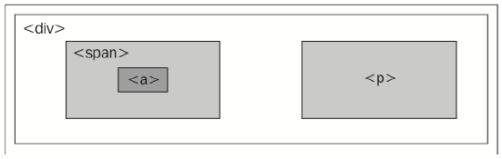
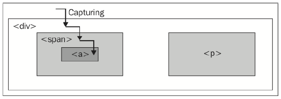
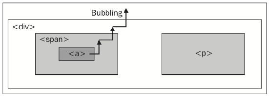

# Handling Events #

[More](../C#event-methods)

## $(document).ready和window.onload的区别 ##

[Link](../01#ready)

## Handling multiple scripts on one page ##

	function doStuff() {
		// Perform a task...
	}

	window.onload = doStuff;

	//---

	<body onload="doStuff();">

## Alternate syntax for .ready() ##

	$(document).ready(function() {
	// Our code here...
	});

or
	//更加就手
	$(function() {
	// Our code here...
	});

## Passing an argument to the .ready() callback ##

解决多种库的$冲突

	
	
	
	

---

	jQuery(document).ready(function($) {
	// In here, we can use $ like normal!
	});

---

	////更加就手
	jQuery(function($) {
	// Code that uses $.
	});

## Handling simple events ##

	$(document).ready(function() {
		$('#switcher-large').on('click', function() {
			$('body').addClass('large');
		});
	});

---

	$(document).ready(function() {
		$('#switcher-default').on('click', function() {
			$('body').removeClass('narrow');
			$('body').removeClass('large');
		});
		$('#switcher-narrow').on('click', function() {
			$('body').addClass('narrow');
			$('body').removeClass('large');
		});
		$('#switcher-large').on('click', function() {
			$('body').removeClass('narrow');
			$('body').addClass('large');
		});
	});

## Making use of the event handler context ##

this关键词 - 函数所属对象

When any event handler is triggered, the keyword this refers to the DOM element to which the behavior was attached. 

Earlier we noted that the $() function could take a DOM element as its argument; this is one of the key reasons why that facility is available.

By writing $(this) within the event handler, we create a jQuery object corresponding to the element, and we can act on it just as if we had located it with a CSS selector.

	var count = 0;
	
	//p是选择器，指body的后代p
	$( "body" ).on( "click", "p", function() {
		var $this = $(this)
		console.log($this.text())
		
		$this.after( "
Another paragraph! " + (++count) + "
" );
	});

## Event propagation ##

The CSS specification includes a pseudo-class called :hover, which allows a stylesheet to affect an element's appearance when the user's mouse cursor hovers over it. 

We will take this opportunity to introduce jQuery's .hover() method, which allows us to use JavaScript to change an element's styling—and indeed, perform any arbitrary action—both when the mouse cursor enters the element and when it leaves the element.

	$(document).ready(function() {
		$('#switcher h3').hover(function() {
			$(this).addClass('hover');
		}, function() {
			$(this).removeClass('hover');
		});
	});

### The journey of an event ###

event propagation

**jQuery always registers event handlers for the bubbling phase of the model**.

	

		
			<a href="http://www.example.com/">
				The quick brown fox jumps over the lazy dog.
			</a>
		
		

			How razorback-jumping frogs can level six piqued gymnasts!
		

	

For any event, there are multiple elements that could logically be responsible for reacting. When the link on this page is clicked, for example, the `
`, ``, and `<a>` elements should all get the opportunity to respond to the click. After all, these three elements are all under the user's mouse cursor at the time. The `
` element, on the other hand, is not part of this interaction at all.

One strategy for allowing multiple elements to respond to a user interaction is called **event capturing**. With event capturing, the event is first given to the most allencompassing element, and then to progressively more specific ones. In our example, this means that first the `
` element gets passed the event, then the `` element, and finally the `<a>` element, as shown in the following figure:

The opposite strategy is called **event bubbling**. The event gets sent to the most specific element, and after this element has an opportunity to react, the event **bubbles up** to more general elements. In our example, the `<a>` element would be handed the event first, and then the `` and `
` elements in that order, as shown in the following figure:

---

Unsurprisingly, different browser developers originally decided on different models for **event propagation**.

**The DOM standard** that was eventually developed thus specified that both strategies should be used: first the event is captured from general elements to specific ones, and then the event bubbles back up to the top of the DOM tree. Event handlers can be registered for either part of the process.

To provide consistent and easy-to-understand behavior, **jQuery always registers event handlers for the bubbling phase of the model**. We can always assume that the most specific element will get the first opportunity to respond to any event.

### Side effects of event bubbling ###

事件冒泡的副作用

Event bubbling can cause unexpected behavior, especially when the wrong element responds to a mouseover or mouseout event. Consider a mouseout event handler attached to the `
` element in our example.

When the user's mouse cursor exits the `
` element, the mouseout handler is run as anticipated. Since this is at the top of the hierarchy, no other elements get the event. On the other hand, when the cursor exits the `<a>` element, a mouseout event is sent to that. This event will then bubble up to the `` element and then to the `
` element, firing the same event handler. This bubbling sequence is likely not desired.

---

The `mouseenter` and `mouseleave` events, either bound individually or combined in the `.hover()` method, are aware of these bubbling issues, and when we use them to attach events, we can ignore the problems caused by the wrong element getting a mouseover or mouseout event.

`.hover()`对事件冒泡副作用免疫

[example1](../C/082.html), [example2](../C/083.html)

The `mouseout` scenario just described illustrates the need to constrain the scope of an event. 

While `.hover()` handles this specific case, we will encounter other situations in which we need to limit an event **spatially空间上** (preventing the event from being sent to certain elements) or **temporally** (preventing the event from being sent at certain times).

## Altering the journey – the event object ##

### Event targets ###

	$(document).ready(function() {
		$('#switcher').click(function(event) {
			if (event.target == this) {
				$('#switcher button').toggleClass('hidden');
			}
		});
	});

### Stopping event propagation ###

The event object provides the `.stopPropagation()` method, which can halt the bubbling process completely for the event.

Like `.target`, this method is a basic DOM feature, but cannot be safely used as such in Internet Explorer 8 or older. As long as we register all of our event handlers using jQuery, though, we can use it with impunity免于惩罚.

	$(document).ready(function() {

		$('#switcher button').click(function(event) {
			//...
			event.stopPropagation();
		});
	});

Prevents the event from bubbling up the DOM tree, preventing any parent handlers from being notified of the event.

### Preventing default actions ###

组织默认事件

如

1. `<a>`和click
2. `<form>`和enter

If our click event handler was registered on a link element (`<a>`) rather than a generic `<button>` element outside of a form, we would face another problem. When a user clicks on a link, the browser loads a new page. This behavior is not an event handler in the same sense as the ones we have been discussing; instead, this is the default action for a click on a link element. 

Similarly, when the Enter key is pressed while the user is editing a form, the submit event may be triggered on the form, but then the form submission actually occurs after this.

If these default actions are undesired, calling `.stopPropagation()` on the event will not help. These actions occur nowhere in the normal flow of event propagation.Instead, the `.preventDefault()` method will serve to stop the event in its tracks before the default action is triggered.

Event propagation and default actions are independent mechanisms; either of them can be stopped while the other still occurs. If we wish to halt both, we can `return false` at the end of our event handler, which is a shortcut for calling both `.stopPropagation()` and `.preventDefault()` on the event.

### Delegating events ###

One great technique that exploits bubbling is called **event delegation**. With it, we can use an event handler on a single element to do the work of many.

In our example, there are just three `<button>` elements that have attached `click` handlers. But what if there were many? This is more common than you might think. 

Consider, for example, a large table of information in which each row has an interactive item requiring a `click` handler. Implicit iteration makes assigning all of these `click` handlers easy, but performance can suffer because of the looping being done internally to jQuery, and because of the memory footprint of maintaining all the handlers.

Instead, we can assign a single `click` handler to an ancestor element in the DOM. An uninterrupted `click` event will eventually reach the ancestor due to event bubbling, and we can do our work there.
	
	$(document).ready(function() {
		$('#switcher').click(function(event) {
			if ($(event.target).is('button')) {//<--------
				//...
			}
		});
	});

### Using built-in event-delegation capabilities ###

	$('#switcher').on('click', 'button', function() {
		var bodyClass = event.target.id.split('-')[1];
		$('body').removeClass().addClass(bodyClass);
		$('#switcher button').removeClass('selected');
		$(this).addClass('selected');
	});

.delegate() and .undelegate()也有相同功效

## Removing an event handler ##

	$(document).ready(function() {
		$('#switcher').click(function(event) {
			if (!$(event.target).is('button')) {
				$('#switcher button').toggleClass('hidden');
			}
		});

		$('#switcher-narrow, #switcher-large').click(function() {
			$('#switcher').off('click');
		});
	});

### Giving namespaces to event handlers ###

精准定位事件处理器，让绑定或取消更容易。

We need to make our .off() call more specific so that it does not remove both of the click handlers we have registered. One way of doing this is to use event namespacing. We can introduce additional information when an event is bound that allows us to identify that particular handler later. To use namespacing, we need to return to the non-shorthand method of binding event handlers, the `.on()` method itself.

	$(document).ready(function() {

		//'click.collapse'使用了命名空间
		$('#switcher').on('click.collapse', function(event) {
			if (!$(event.target).is('button')) {
				$('#switcher button').toggleClass('hidden');
			}
		});

		$('#switcher-narrow, #switcher-large').click(function() {
			$('#switcher').off('click.collapse');//使用了命名空间
		});
	});

### Rebinding events ###

让函数赋值于变量，与匿名函数相比，变量可重复使用

	$(document).ready(function() {

		//函数变量
		var toggleSwitcher = function(event) {
			if (!$(event.target).is('button')) {
				$('#switcher button').toggleClass('hidden');
			}
		};

		$('#switcher').on('click', toggleSwitcher);

		$('#switcher button').click(function() {
			$('#switcher').off('click', toggleSwitcher);
			if (this.id == 'switcher-default') {
				$('#switcher').on('click', toggleSwitcher);
			}
		});
	});

	//一次性handler，点击一次后便失效
	$('#switcher').one('click', toggleSwitcher);

## Simulating user interaction ##

	$(document).ready(function() {
		$('#switcher').trigger('click');
	});

	//就手
	$(document).ready(function() {
		$('#switcher').click();
	});

### Reacting to keyboard events ###

	$(document).ready(function() {
		var triggers = {
			D: 'default',
			N: 'narrow',
			L: 'large'
		};
		$(document).keyup(function(event) {
			var key = String.fromCharCode(event.which);
			if (key in triggers) {
				$('#switcher-' + triggers[key]).click();
			}
		});
	});
